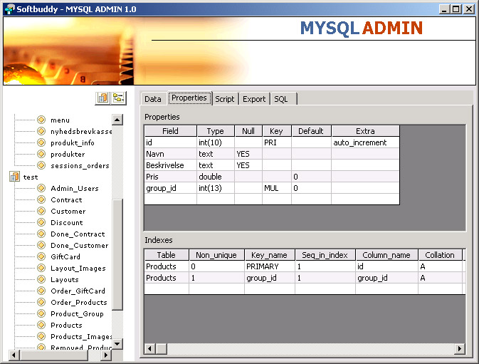



## MYSQL Admin

### Description

Hi All

This is a little MYSQL ADMIN project i worked on, but never got around to make done, so I thought I share it with you people.

I was going for something like TOAD for oracle, if anyone knows that program, but It's only 50% done.

You going to need the ODBC driver. You can download the MyODBC-3.51.06.exe at

http://www.mysql.com/products/connector/odbc/

Hope you enjoy the program.

CiX
 
### More Info
 

             |
---                |---
**Submitted On**   |2004-05-28 20:47:20
**By**             |[CiX](https://github.com/Planet-Source-Code/PSCIndex/blob/master/ByAuthor/cix.md)
**Level**          |Advanced
**User Rating**    |5.0 (35 globes from 7 users)
**Compatibility**  |VB 5\.0, VB 6\.0
**Category**       |[Complete Applications](https://github.com/Planet-Source-Code/PSCIndex/blob/master/ByCategory/complete-applications__1-27.md)
**World**          |[Visual Basic](https://github.com/Planet-Source-Code/PSCIndex/blob/master/ByWorld/visual-basic.md)
**Archive File**   |[MYSQL\_Admi1762726272004\.zip](https://github.com/Planet-Source-Code/cix-mysql-admin__1-54623/archive/master.zip)

